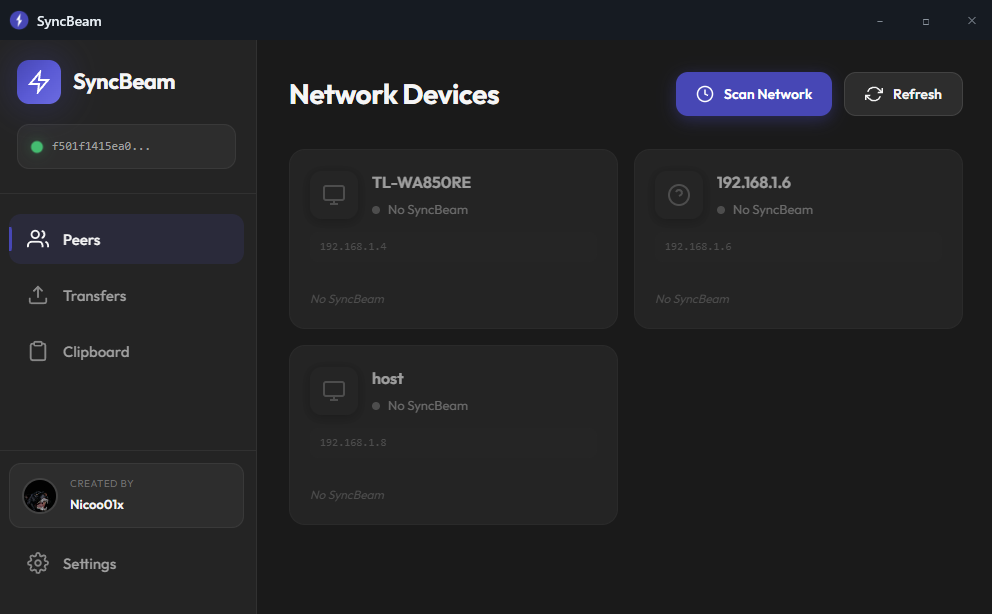

<div align="center">

# SyncBeam

### P2P File and Clipboard Transfer for Windows

[](https://github.com/Nicoo01x/SyncBeam/releases)
[](https://opensource.org/licenses/MIT)
[](https://dotnet.microsoft.com/)
[](https://www.microsoft.com/windows)
[](CONTRIBUTING.md)

<p align="center">
  <strong>No servers - 100% Local - Ultra fast - Zero configuration</strong>
</p>

</div>

---

## Screenshots

<div align="center">

| Network Devices | File Transfers |
|:---------------:|:--------------:|
|  |  |

</div>

---

## What's New in v4.0

- **Automatic Firewall Configuration**: No more manual scripts - SyncBeam configures Windows Firewall automatically
- **UPnP Port Mapping**: Automatically opens ports on your router for external connections
- **NAT Detection**: Detects NAT type using STUN servers for better connectivity
- **Network Diagnostics**: Built-in diagnostic tools to troubleshoot connection issues
- **Hole Punching**: Improved NAT traversal for connecting peers behind different NATs
- **Better Error Messages**: Detailed diagnostics when connections fail

### Previous in v3.0

- **Zero Configuration**: Devices auto-discover and connect automatically
- **Network Scanner**: See all devices on your network
- **E2E Encryption**: Military-grade security with Noise Protocol

---

## Features

| Feature | Description |
|---------|-------------|
| **Auto-discovery** | Automatically finds and connects to SyncBeam devices on your network |
| **Network Scanner** | See all devices on your LAN with device-type detection |
| **E2E Encryption** | Noise Protocol XX + AES-256-GCM for maximum security |
| **File Transfer** | Support for files >10GB with automatic resume |
| **Clipboard Sync** | Text, images, RTF and HTML synced in real-time |
| **Drag & Drop** | Drag files to the outbox to send them automatically |
| **Modern UI** | Dark glassmorphism interface with WebView2 |
| **No cloud** | Zero servers, zero tracking, 100% peer-to-peer |

---

## Quick Start

### Requirements

- Windows 10/11
- [.NET 8.0 SDK](https://dotnet.microsoft.com/download/dotnet/8.0)
- WebView2 Runtime (included in Windows 10/11)

### Installation

```bash
# Clone the repository
git clone https://github.com/Nicoo01x/SyncBeam.git
cd SyncBeam

# Restore dependencies
dotnet restore

# Build
dotnet build

# Run
dotnet run --project SyncBeam.App
```

### Quick Usage

1. **Run SyncBeam** on two or more PCs on the same network
2. **Devices auto-discover** and connect automatically
3. **Scan Network** to see all devices on your LAN
4. **Transfer** by dragging files or copying to clipboard

> No configuration needed! SyncBeam uses zero-config networking.

---

## Architecture

```
+------------------------------------------------------------------+
|                         SyncBeam.App                              |
|                    (WPF + WebView2 UI)                            |
+------------------------------------------------------------------+
|  SyncBeam.Streams  |  SyncBeam.Clipboard  |    SyncBeam.UI       |
|  (File Transfer)   |  (Clipboard Sync)    |   (HTML/CSS/JS)      |
+------------------------------------------------------------------+
|                         SyncBeam.P2P                              |
|  +-------------+-------------+-------------+------------------+   |
|  |  Discovery  |  Handshake  |  Transport  |  NatTraversal    |   |
|  |   (mDNS)    | (Noise XX)  |  (TCP+AES)  |    (STUN)        |   |
|  +-------------+-------------+-------------+------------------+   |
+------------------------------------------------------------------+
```

### Project Structure

```
SyncBeam/
├── SyncBeam.App/              # Main WPF application
│   ├── MainWindow.xaml        # Window with WebView2
│   └── WebViewHost.cs         # JS <-> C# bridge
│
├── SyncBeam.P2P/              # P2P networking library
│   ├── Core/                  # Cryptography (Ed25519, AES-GCM)
│   ├── Discovery/             # mDNS for discovery
│   ├── Handshake/             # Noise Protocol XX
│   ├── Transport/             # Secure TCP transport
│   ├── NatTraversal/          # STUN + hole punching
│   ├── Network/               # Firewall, UPnP, Diagnostics
│   └── PeerManager.cs         # Peer management
│
├── SyncBeam.Streams/          # Transfer engine
│   ├── FileTransferEngine.cs  # Chunked streaming + resume
│   └── OutboxWatcher.cs       # Auto-beam from outbox
│
├── SyncBeam.Clipboard/        # Clipboard synchronization
│   └── ClipboardWatcher.cs    # Monitor + sync
│
├── SyncBeam.UI/               # Web interface
│   ├── index.html
│   ├── styles.css             # Glassmorphism UI
│   └── app.js
│
└── SyncBeam.Console/          # CLI test app
    └── Program.cs
```

---

## Security

SyncBeam implements military-grade security:

| Layer | Technology | Purpose |
|-------|------------|---------|
| **Identity** | Ed25519 | Unique signing keys per device |
| **Handshake** | Noise Protocol XX | Mutual authentication with identity hiding |
| **Transport** | AES-256-GCM | Authenticated encryption of all data |
| **Integrity** | SHA-256 | Verification of each transferred chunk |
| **Network** | LAN Only | Connections restricted to local network |

### Handshake Flow

```
    Initiator                                    Responder
        |                                             |
        |---- e ---------------------------------------->|  1. Send ephemeral key
        |                                             |
        |<--- e, ee, s, es ----------------------------|  2. DH exchange + encrypted static key
        |                                             |
        |---- s, se ---------------------------------->|  3. Static key + verification
        |                                             |
        |<--- OK -------------------------------------|  4. Secure channel established
        |                                             |
```

---

## Directories

| Directory | Purpose |
|-----------|---------|
| `~/SyncBeam/inbox` | Received files are saved here |
| `~/SyncBeam/outbox` | Drag files here to send them automatically |

---

## Development

### Build from source

```bash
# Debug
dotnet build

# Release
dotnet build -c Release

# Publish standalone executable
dotnet publish -c Release -r win-x64 --self-contained
```

### Run tests

```bash
# P2P test console (first terminal)
dotnet run --project SyncBeam.Console

# In another terminal
dotnet run --project SyncBeam.Console
```

> Both instances will auto-discover and connect on the same network.

### Test console commands

| Command | Description |
|---------|-------------|
| `list` | List discovered peers |
| `connect` | Connect to a peer |
| `peers` | Show connected peers |
| `send` | Send test message |
| `ping` | Ping all peers |
| `refresh` | Refresh discovery |
| `quit` | Exit |

---

## Contributing

Contributions are welcome! Please read [CONTRIBUTING.md](CONTRIBUTING.md) for details.

---

## License

This project is licensed under the MIT License - see [LICENSE](LICENSE) for details.

---

<div align="center">

[Back to top](#syncbeam)

</div>
